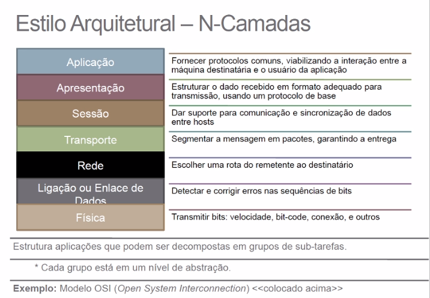

# Estilos Arquiteturais
Uma arquitetura de software pode orientar-se por um estilo arquitetural. Trata-se de um conjunto de padrões, os quais procuram impor um determinado grau de uniformidade à arquitetura. São componentes e conectores específicos que funcionam como base
Expressa:
* Uma organização estrutural.
* Um conjunto pré-definido de substemas e suas responsabilidades
* Inclui regras e diretrizes para organizar o relacionamento entre os subsistemas

**Exemplos:** Stand-alone, Cliente-servior, P2P, Objetods Distribuídos, N-camadas, Filtros e Dutos, Repositório, Orientado a Eventos(Publisher/Subscriber), Orientado a Serviços(SOA).

## Estilo Stand-Alone
Mais simples dos estilos arquiteturais. Basicamente, baseia-se em projetar uma solução autossuficiente, a qual não depende de terceiros. Normalmente, esses terceiros são servidores especializados em fornecer serviços e/ou conteúdos.
* Estilo indicado para projeto mais simples. Quando complexos, os prjetos podem demandar soluções distribuídas, com comunicações entre clientes e servidores, P2P ou outro.

| Vantagens | Desvantagens |
|-----------|--------------|
| Simplicidade | Limitação da capacidade do projeto de expandir |

## Estilo N-Camadas
Usado para modelar a interface dos subsistema, organiza o sistema em um conjunto de camadas, cada uma das quais fornece um conjunto de serviços. Esse padrão apoia o desenvolvimento incremental de subsistemas em diferentes camadas, e quando uma camada é alterada, normalmente, apenas a camada adjacente é afetada.

*Modelo OSI*

**CUIDADOS:**
* As camadas de níveis superiores dependem das camadas de níveis inferiores.
* Partes do sistema devem permitir serem trocadas
    * Trocar a camada de Comunicação
    * Trocar a camada de acesso
* Podem existir várias camadas em um mesmo nível de abstração, dependendo de camadas inferiores.

**DIRETRIZES:**
* Procure estruturar o sistema em camadas, sobrepondo as mesma em níveis de abstração diferentes.
* Lembre-se que os serviços da camada X, se dependentes de algo, que essa dependência esteja, preferencialmente restrita à camada X-1. (**Arquitetura Restrita**)
* Se houver necessidade de depender de mais de uma camada inferior (**Arquitetura Relaxada**)
* O inverso, ou seja, camadas inferiores dependerem de camadas superiores não é desejado!

| Vantagens | Desvantagens |
|-----------|--------------|
| Reutilização de Camadas | Cascateamento de alterações para as camadas superiores, quando o comportamento de uma camada inferior sofre alteração /adaptações |
| Dependências tendem a permanecer locais | - |
| Flexibilidade para organizar multi-níveis de abstração | - |
| Permite trabalhar com sistemas de dinâmicas complexas | - |

## Estilo Cliente-Servidor
Estilo que separa clientes e servidores, sendo interligados entre si, geralmente utilizando uma rede de computadores. Cada instância de um cliente pode enviar requisições de dados para algum dos servidores conectados e esperar pela resposta. Por sua vez, algum dos servidores disponíveis podem aceitar essas requisições, processá-las, e retornar o resultado para o cliente.

* Entre o cliente e servidor existe um **Protocolo de Comunicação**.
* O cliente e servidor podem residir no mesmo sistema.
* A máquina servidor é um host que está executando um ou mais programas de servidor que partilham seus recursos com os clientes. 
* Um cliente não compartilha seus recursos, mas solicita um conteúdo ou serviço de um servidor.
* Os clientes iniciam sessoes do comunicação com os servidores que esperam as solicitações de entrada.

### Cliente
* Sempre inicia solicitações/requisições aos servidores.
* Espera e recebe respostas.
* Normalmente conecta-se a um pequeno número de servidores de uma só vez.
* Normalmente interage diretamente com os usuários finais por meio de interfaces, como interface gráfica.

### Servidor
* Sempre espera por uma solicitação/requisição de um dos clientes.
* Recebe as solicitações/requisições encaminhadas pelos clientes procurando respondê-las/atendê-las.
* Um servidor pode se comunicar com outros servidores, a fim de atender a uma solicitação/requisição do cliente.

| Vantagens | Desvantagens |
|-----------|--------------|
| Na maioria dos casos, permite que as responsabilidades de um sistema possa ser distribuída entre vários computadores independentes, que estão conectados por meio de um rede. | Redes de tráfego  de bloqueio|
| Maior facilidade de manutenção (é possível substituir, reparar, atualizar ou realocar um servidor de seus clientes, minimizando os impactos dessa mudança)| Como o número de colicitações simultâneas de cliente para um determinado servidor pode ser razoável, o servidor pode ficar sobrecaregado|
| Todos os dados são armazenados nos servidores, que geralmente possuem controle de segurança muito superiores do que a maioria|  Elevado custo de comunicação|
| Servidores podem controlar mais adequadamente o acesso bem como os recursos, garantindo que apenas os clientes com as permissões apropriadas possam acessar e alterar dados | Não possui robustez como de uma rede P2P |
| Como o armazenamento de dados é centralizado, as atualizações desses dados são mais facilmente administrados.| Se um servidor crítico falhar, os pedidos dos clientes podem não ser cumpridos|
| Muitas tecnologias avançadas de cliente-servidor já estão disponíveis, muitas delas projetadas para garantir segurança, acessibilidade e usabilidade |

### Protocolos
Existem duas formas para que se estabeleça uma ligação cliente-servidor:

1. **Orientada a conexão (TCP - *Transmission Control Protocol*)**

O cliente estabelece uma conexão com o servidor e ambos trocam múltiplas mensagens de tamanhos variados, sendo a aplicação do cliente quem termina a sessão (Ex: email).

* Funcionamento mais complexos
* Mais controles, mais seguro em relação ao recebimento de dados
* Estabelece conexão antes de transmitir os dados (Transporte)
* Solicita retransmissão dos dados não recebidos ou corrompidos. 

2. **Não orientada à conexão (UDP - *User Datagram Protocol*)**

O cliente constói uma mensagem e a envia num pacote UDP para o servidor, o qual responde sem estabelecer uma conexão permanente com o cliente. Mais utilizado em aplicações de tempo real, por privilegiar velocidade e simplicidade (Ex: VolP)

* Funcionamento mais simples
* Mais rápidp por ter menos Controles
* Menos seguro em relação ao recebimento dos dados (Transporte)
* Não estabelece conexão

## Estilo P2P
É uma arquitetura de sistemas distribuídos caracterizada pela descentralização das funções na rede, onde cada nó realiza tanto funções de cliente quando de servidor.

**Responsabilidade do Peer como cliente**
* Enviar pedidos de serviço a outros peers
* Receber as respostas de pedidos de serviço feitos a outros peers.

**Responsabilidade do Peer como servidor**
* Receber pedidos de serviço de outros peers
* Processar os pedidos e xecutar o serviço requerido
* Enviar resposta com os resultados do serviço requerido
* Propagar os pedidos de serviço a outros peers

| Vantagens | Desvantagens |
|-----------|--------------|
| Elimina o gargalo de fonte única, usando o P2P para distribuir dados e fazer o balancemaneto de pedidos na rede| Implementação bem mais complexa, demandando mais conhecimento da equipe de implantação e manuntenção
| Elimina o risco de um único ponto de falha | Overheads - Comunicações replicadas entre pares, ou seja, mesma busca sendo processada por muitos nó diferentes |
| A infraestrutura P2P permite acesso direto aos recursos compartilhados e isso confere capacidade de manutenção remota|

## Estilo Objetos Distribuídos
É uma arquitetura de sistemas distribuídos muito parecida com P2P, porém possui um Middleware, intermediando o processo de comunicação.

## Estilo Filtros e Dutos

Oferece uma estrutura para sistemas que processam fluxos de dados, considerando a existÊncia de uma rede pela qual flui os dados de um extremidade (origem) à outra (destino).

* O fluxo de dados se dá através de pipes (dutos) e os dados sofrem transformações quando processados nos filters (filtros).
* Um duto provê uma forma unidirecional de fluxo de dados, uma vez que atua como um condutor para o fluxo de dados entre a fonte e o destino.
*  Divide uma grande tarefa de processamento em uma sequência de pequenos e independentes passos de processamento (Filters), os quais são conectados por canais (Pipes).

* **Filtro (Filter)**
1. Receber o dado da entrada
2. Processar o dado
3. Colocar o dado na saída

* ***Duto (Pipe)**
1. Transferir o dado
2. Realiza "buffer"
3. Sincronizar os filtros vizinhos

* **Outros Participantes**
1. Fontes de dados (Data source)
2. Coletor de dados (Dara sink)

| Vantagens | Desvantagens |
|-----------|--------------|
| O resultado é uma composição de filtros| Mudanças frequentes em um filtro impacta outros|
| Facilita o entendimento de Todo e Parte |Difícil uso em aplicações iterativas, pois coloca em ênfase o mado "batch"|
| Manutenabilidade mais flexível | Pode ter deadlock com o uso de buffers finitos|
| Facilita a reutilização, manutenção e extensão |
| Desempenho melhorado pelo processamento paralelo de filtros|

## Estilo Repositório
Subsistemas devem trocar dados. Isso pode ser feito de duas formas,
principais:
* Dados compartilhados são guardados em um banco de dados central ou
repositório, e podem ser acessados por todos os subsistemas, ou
* Cada subsistema mantém seu próprio banco de dados, e transmite dados
explicitamente para outros subsistemas.

Quando grandes quantidades de dados devem ser compartilhadas, é mais comum o uso do modelo de **repositório compartilhado**, sendo esse um eficiente mecanismo de compartilhamento de dados. Sendo que todos os dados em um sistema serão gerenciados em um único repositório central, acessível a todos os componentes do sistema. Os componentes não interagem entre si, apenas por meio deste repositório.

* Muito utilizado quabdo um sistema demanda grande volume de informação, que precisa ser geradoe armazenado por um longo tempo.
* Há também aplicabilidade ao estilo quando os sistemas são dirigidos a dados, nos quais a inclusão desses dados no repositório dispara uma ação

| Vantagens | Desvantagens |
|-----------|--------------|
| Os componentes podem ser independentes, então alterações feitas em um componente não costuma influenciar outro | O repositório é um ponto único de falha, problemas nele podem afetar o sistema todo |
| Todos os dados podem ser gerenciados de forma consistente, pois há centralização desses dados em um único repositório | Podem ocorrer ineficiências na organização de toda a comunicação por meio do repositório |
| | Distribuí-lo por meio de vários computadores pode ser complicado |
