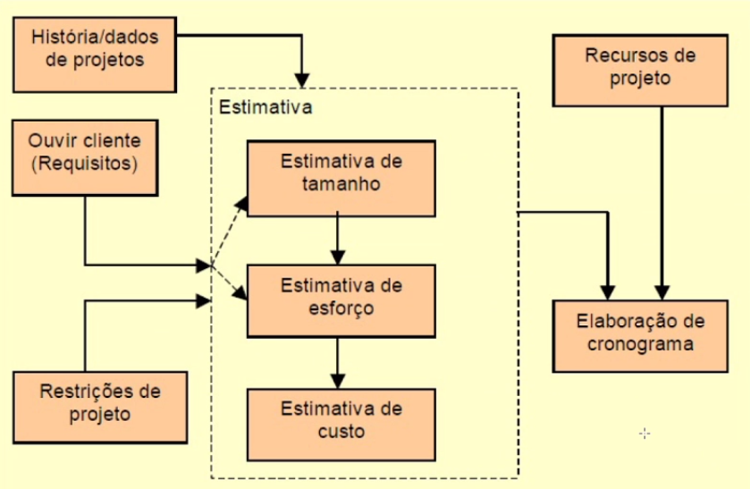

# Estimativas

* O que é software?
Produto complexo que não é fabricado e sim desenvolvido, orientando-se por um processo bem definido e por atividades cumpridas de forma disciplinada.

* Quais seriam as principais matérias primas envolvidas nesse processo de desenvolvimento?
  * Recursos financeiros e físicos -> **podem ser suficientes ou insuficientes**
  * Prazos -> **variam muito do cliente, projeto**
  * Habilidade intelectual dos desenvolvedores (Recursos Humanos) -> **pode variar bastante**

*As estimativas existem justamente para trabalhar com essas incertezas!!*

## Como estimar
Estimar demanda, prioritariamente:
1. Realizar estudo de viabilidade
2. Selecionar um método de estimativa (*Pontos de Função, COCOMO, Price-to-Win, Avaliação de Especialistas*)
3. Dispor de medidas de produtividade (velocity, burndown)
4. Conhecer ou definir a duração do projeto
5. Prever os custos do projeto

**Pontos de função**: pontuação por funcionalidades

**COCOMO**: série de tabelas e fórmulas (mais formal e preciso)

**Price-to-Win**: joga o valor do projeto para baixo.

 

## Depois de Estimar
* Formalizar o que foi gerado (Carta de encaminhamento da proposta)
  * Apresentação
  * Objetivo
  * Metodologia
  * Atividade e resultados
  * Cronograma de realização
  * Cronograma de execução
  * Investimento
  * Pagamento
  * Serviço de manutenção
