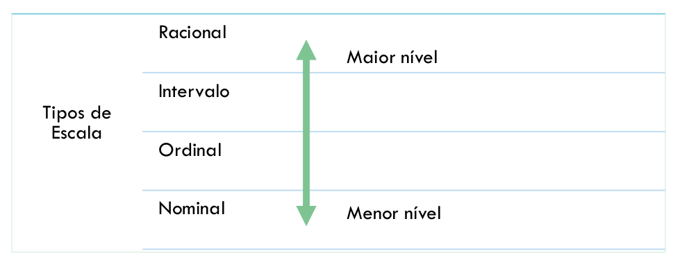

# Fundamentos de Medição

## O que é medição?
Medição é o **processo** pelo qual números e símbolos são atribuídos aos **atributos** de **entidades** do mundo real como uma forma de descrevê-los de acordo com regras claramente definidas.

## Conceitos
* **Entidade**: Objeto a ser caracterizado pela medição dos seus atributos.
* **Atributo (mensurável)**: É uma propriedade destinguível ou uma característica de uma entidade de software. Uma entidade pode ter vários atributos, mas somente alguns podem ser medidos.
* **Medição**: Processo de coletar métrica.
* **Medida**: Valor Coletado para uma métrica.
* **Métrica**: Um metódo de medição e uma escala de medida. Incluem métodos para caracterizar os dados quantitativos.

### Exemplos
| Entidade | Atributo | Measure |
| - | - | - |
| Projeto Completo | Duração | Meses do início ao fim |
| Projeto Completo | Duração | Dias do início ao fim |
| Código | Tamanho | Número de linhas de código (LOC)|
| Código | Confiabilidade | Tempo médio de falha (MTTF) em horas de CPU |
| Testes | Eficiência | Número de falhas encontradas por número de casos de teste |
| Testes | Eficácia | Número de falhas encontradas por KLOC(thousand LOC)|

## Tipos de Medição
### Direta
* Constitui o processo natural de tentar entender as entidades e os atributos que elas possuem. Mas não exclui a possibilidade de medições mais precisas que poderão ser atingidas indiretamente.
* Oatributo de uma entidade não envolve nenhum outro atributo ou entidade.
* Ex: tamanho do código fonte, duração do processo de teste, número de defeitos descobertos.

### Indireta
* O atributo de uma entidade envolve outro atributo ou entidade.
* Ex: Densidade de defeito do módulo = nº de defeitos / tamanho do módulo

## Classificação das Medidas
* Objetivas: Expressões numéricas ou representações gráficas de expressões numéricas que podem ser computadas a partir da medição de uma entidade, produto ou recurso.
* Subjetivas: Medidas relativas, baseadas em estimativas pessoais ou de grupo. Ex: bom, ruim...

## Escala de Medição
* Escala é um conjunto de valores ordenados ou um conjunto de categorias para o qual um atributo é mapeado.
* Define um intervalo de valores possíveis que podem ser produzidos ao executar um método de medição.
* Provê valores e unidades para a descrição dos atributos das entidades que estão sendo medidas e podem ser de diferentes tipos.

### Tipos de Escala
#### Nominal
* É o mais simples tipo de escala. Classifica os elementos em categorias no que diz respeito a um determinado atributo;
* Provê um nome ou um valor para um atributo
* A ordem dos valores não tem nenhum significado para a sua interpretação.
* Os nomes das categorias e sua sequencia não estabelece nenhum relacionamento entre as categorias. 
* Ex: religões, cor do cabelo, nome de linguagens de programação...

#### Ordinal
* Acrescenta a noção de ordem à escala nominal;
* Permite que os resultados sejam colocados em uma determinada ordem (ascendente ou descendente);
* É possível não apenas agrupar, mas também ordenar. Mas não oferece informações sobre a magnitude das diferenças entre os elementos.
* Ao transformar as relações em operações matemáticas as operações de adição, subtração, multiplicação e divisão não podem ser usadas.
* Usa-se apenas as relações “maior que” e “menor que”.
* Ex: classe social, satisfação do usuário, níveis de maturidade do CMMI...

#### Intervalo
* Preserva a importância da ordem dos resultados assim como a escala ordinal;
* Possui informações sobre o tamanho dos intervalos que separam os pontos da escala, permitindo realizar uma análise melhor sobre os resultados (FENTON et al., 2015).
* É possível realizar somas e subtrações.
* Ex: horário, datas, temperaturas...

#### Racional
* Preserva as mesmas características da escala de intervalo (possui ordem e tamanho dos intervalos)
* Representa também a razão entre as entidades
* Possui o elemento zero (representa a total ausência do atributo medido)
* Pode iniciar em zero e aumentar em intervalos iguais conhecidos como unidades (FENTON e PFLEEGER, 1997)
* Todas as funções aritméticas podem ser utilizadas gerando resultados
significativos
* Ex: intervalos de tempo, custo, esforço

#### Absoluta
* É feita, unicamente, através da contagem do número de elementos de uma determinada entidade (FENTON e PFLEEGER, 1997).
* Para esta escala só existe uma maneira pela qual a medição pode ser realizada;
* Todas as funções aritméticas produzem resultados significativos.
* Ex: nº de falhas durante um teste de integração, nº de pessoas que trabalham em um projeto

## Classificação das Entidades
Atividades de medição de software iniciam com a identificação de entidades e atributos que queremos medir. As entidades são divididas em 3 classes:

1. **Processo**: Coleção de atividades relacionadas com software. Geralmente está associado a uma escala de tempo. Atividades estão ordenadas ou relacionadas de uma maneira que depende de tempo. Recursos e produtos estão relacionados ao processo.
2. **Recurso**: Entidades requeridas por uma atividade do processo.
3. **Produto**: Qualquer artefato que resulta de uma atividade de processo.

### Entidades de Processo
Podem ser usadas para melhorar um processo de desenvolvimento ou de manutenção de software.

Exemplos:
* A efetividade de remoção de defeitos durante o desenvolvimento,
* Tempo de resposta para corrigir um problema,
* O percentual de problemas resolvidos durante um mês,
* Tempo de entrega de acertos

### Entidades de Produto
Desrevem as características do produto, como:
*  Tamanho
* Complexidade
* Níveis de Qualidade

A norma SQUARE propõe um conjunto de métricas para avaliar a qualidade de um produto de software.

### Entidades de Recurso
Descrevem as características dos recursos utilizados no projeto, como:
* Equipe do projeto
* Ferramentas CASE

## Classificação das Medidas
* **Atributos internos**: Podem ser medidos puramente por meio da análise do processo, produto ou recurso,separado de seu comportamento. Aplicado a um produto não-executável.
* **Atributos externos**: Podem ser medidos somente se relacionados ao seu comportamento que é mais importante que a própria entidade. São obtidos a partir do comportamento do sistema por meio de testes, operação ou observando sua execução em um ambiente