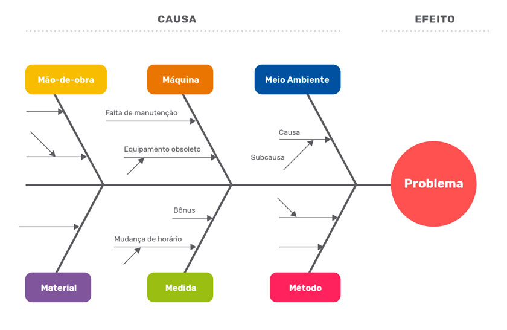
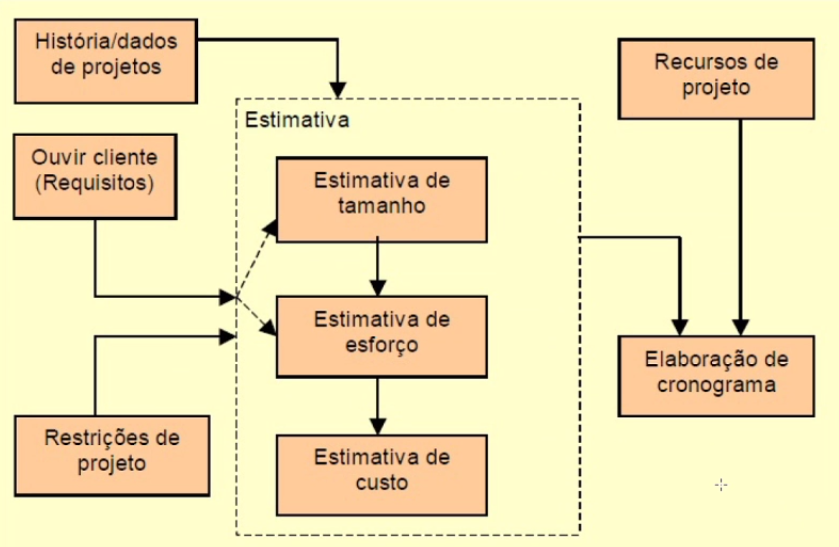
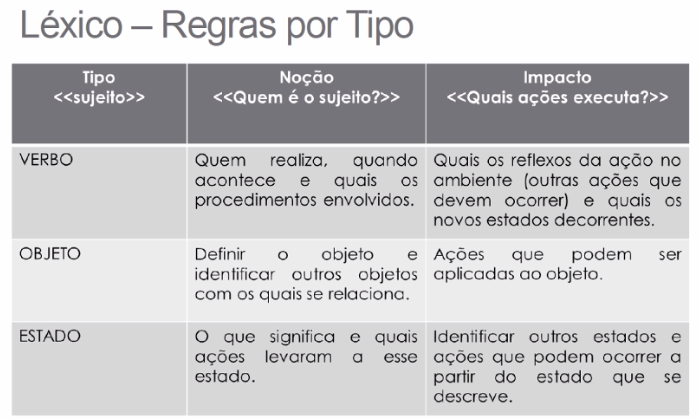
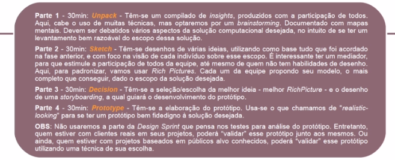

# Projeto Não Orientado a Abordagens Escpecíficas

## Diagrama Causa-Efeito (de Ishikawa)

Exemplo:

* Causas que geram um efeito negativo, um problema a ser resolvido.
* Analisa o problema de diferentes pespectivas.
* Após diagramar, deve-se propor ações corretivas, acompanhar essas ações e gerar relatório por problema.

## Estimativas

* [Mais sobre estimativas](../aulas/estimativas.md) 

## Glossário e Léxicos

* **Glossário**: artefato que se coloca os termos que necessitam de significado.
  * Podem conter imagens, ícones, links, valorizando mais essa especificação)

* **Léxico**: notação de usa descrição de termos, procura descrever os símbolos de uma linguagem.
  * Identificação de palavras ou frases peculiares ao meio social da aplicação)
  * Cada símbolo é descrito com *noção* (o que significa o símbolo - denotação) e *impacto* (efeito/uso/ocorrência do símbolo na apliação - conotação) 
  * Cada **símbolo** tem:
    * Zero ou mais sinônimos
    * Uma ou mais noções
    * Um ou mais impactos

## Design Sprint
* 5 dias de trabalho

1. Unpack
2. Stketch
3. Decision
4. Prototype

