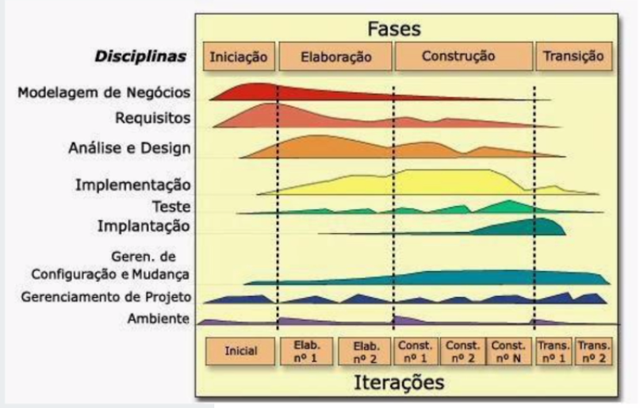

# RUP (Rational Unified Process)

* Muito completo e  complexo
* Desenvolvimento de forma incremental, atividades sendo desenvolvidas de forma cíclica
* Compreende nove disciplinas (acontecemem todas as fases do desenvolvimento, mudando intensidade conforme a fase)
* Há sugestão de artefatos que podem ser feitos

## Ciclo Base
1. Iniciação
2. Elaboração *(voltada para a disciplina)*
3. Construção
4. Transição

## Alinhado à notação UML
* Diagramas de Classe
* Diagramas de Componente
* Diagramas de Pacotes
* Diagramas Dinâmicos: estado, atividade, sequência (comportamental)