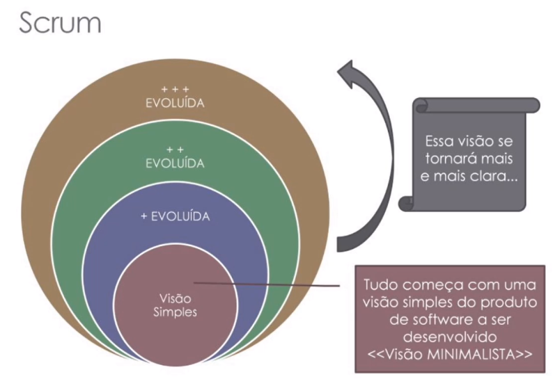
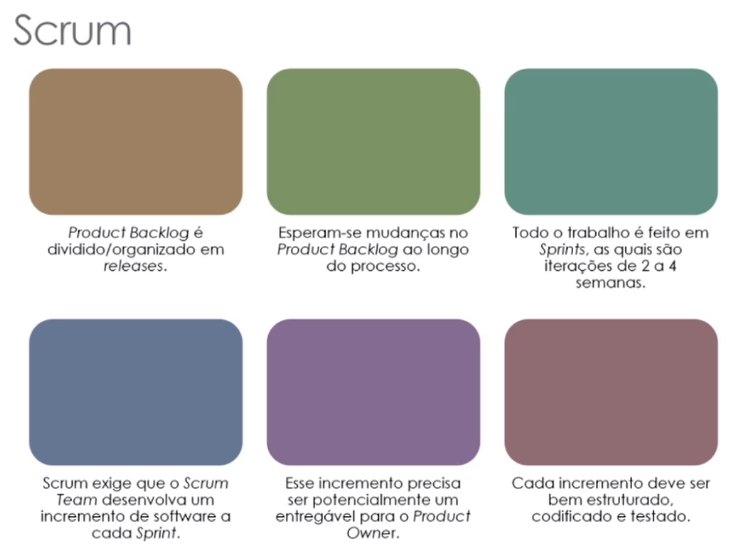

# SCRUM

* Base: Manifesto Ágil
## Ciclo de vida: Iterativo-incremental
* Primeiro analise o que deve ser feito e vai compondo quais incrementos devem ser feitos para cada iteração
* Ao final da iteração deve-se apresentar os resultados aos envolvidos, para dar feedbacks rápidos.
* As entregas devem ser feitas de modo que agregue valor ao produto, ao PO.
* Todas as iterações devem ter algo entregável.
* Sprint Planning, Dailys, Sprint Review, Retrospective

