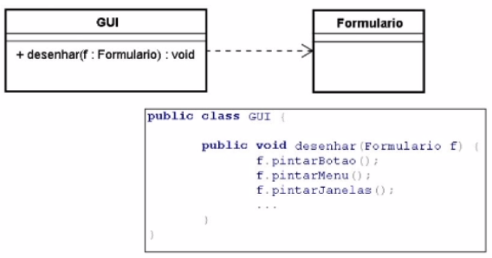

# Modelagem UML
É uma notação visual, com diagramas que ajudam a desenhar uma solução computacional em diferetens níveis de abtração e/ou perspectivas.

**Abordagens tradicionais**:
* Modelagem orientada a objetos
    * UML (Unified Modeling Language)
    * Diagramas estáticos e organizacionais

## Diagrama de Classes
* São exibidos um conjunto de classes, interfaces e seus relacionamentos
*  As classes especificam tanto as propriedades quanto a parte mais comportamental dos objetos.

<https://www.umn-diagrams.org/class-diagrams-overview.html>

|   **Nome**    |   Celular   |
| --------- | ----------- |
| **Atributos** | modelo      |
| **Operações** | atualizar() |

| Símbolo | Acesso | Exemplo |
| ------- | ------ | ------- |
| + | public | + atributo_01, + op_01() |
| - | private | - atributo_02, - op_02() |
| # | protected | # atributo_03, # op_03() |

  

### Relacionamentos
* **Dependência** 
    * new Object()
    * Recebimento como parâmetro

* **Associação** 
    * Especifica a direção da associação (unilateral e bilateral)
    * Cardinalidade (1 para 1, 1 para */n (muitos), n para n, 1 para 2, ...)
    * Voz ativa (Pessoa possui conta)
    * Voz passiva (Conta é possuída pela pessoa)
    * Associação reflexiva: cardialidade na mesma classe

* **Agregação**
* **Composição**
* **Generalização**
* **Realização**

## Diagrama de Componentes
## Diagrama de Pacotes
## Diagramas Comportamentais/Dinâmicos

