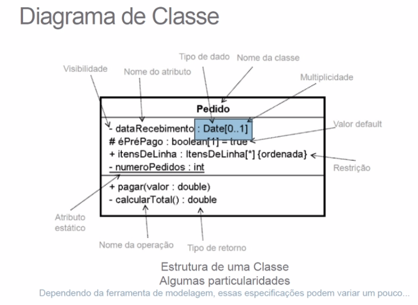
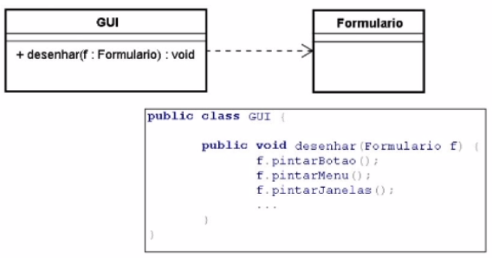
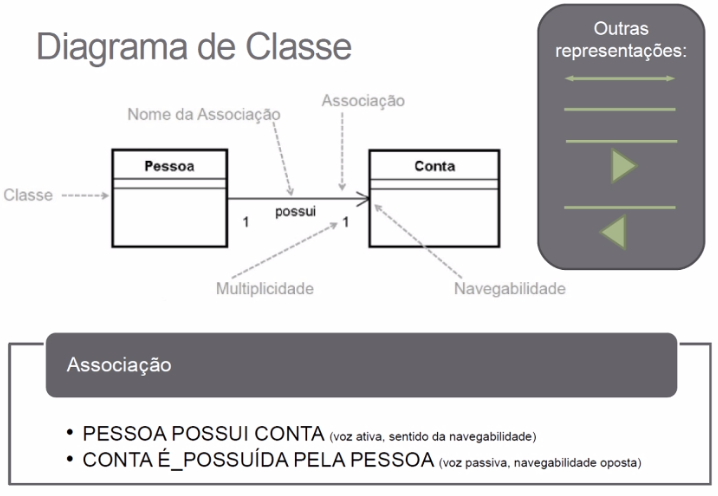
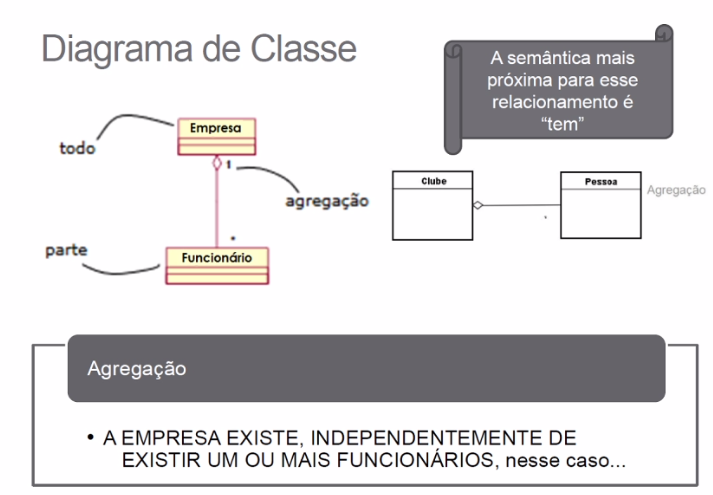
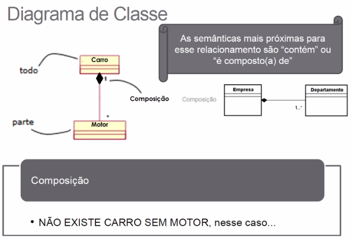
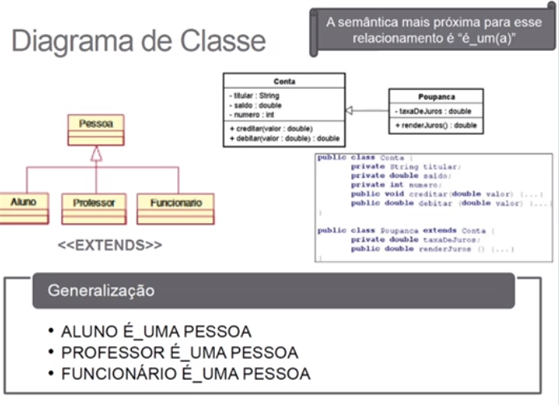
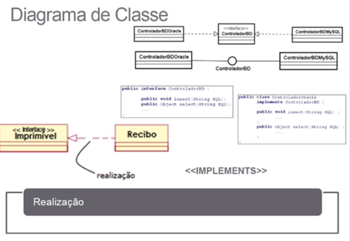
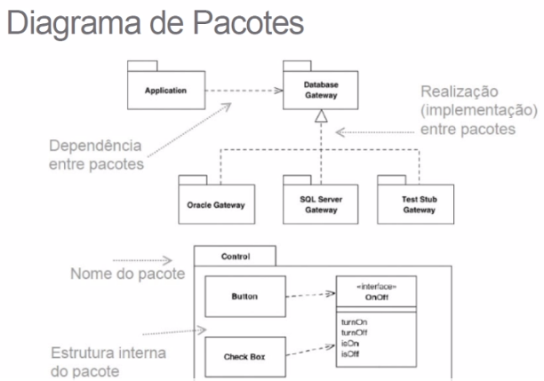
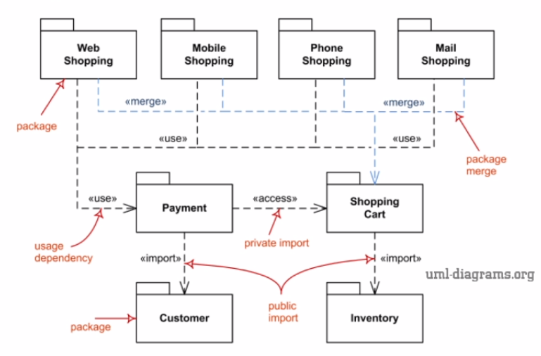
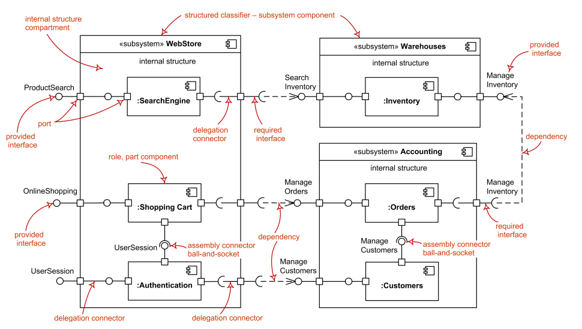

# Modelagem UML Estática
É uma notação visual, com diagramas que ajudam a desenhar uma solução computacional em diferetens níveis de abtração e/ou perspectivas.

**Abordagens tradicionais**:
* Modelagem orientada a objetos
    * UML (Unified Modeling Language)
    * Diagramas estáticos e organizacionais

## Diagrama de Classes
* São exibidos um conjunto de classes, interfaces e seus relacionamentos
*  As classes especificam tanto as propriedades quanto a parte mais comportamental dos objetos.

<https://www.uml-diagrams.org/class-diagrams-overview.html>

|   **Nome**    |   Celular   |
| ------------- | ----------- |
| **Atributos** | modelo      |
| **Operações** | atualizar() |

| Símbolo | Acesso | Exemplo |
| ------- | ------ | ------- |
| + | public | + atributo_01, + op_01() |
| - | private | - atributo_02, - op_02() |
| # | protected | # atributo_03, # op_03() |

  

## Relacionamentos
* **Dependência** 
    * new Object()
    * Recebimento como parâmetro

* **Associação** 
    * Especifica a direção da associação (unilateral e bilateral)
    * Cardinalidade (1 para 1, 1 para */n (muitos), n para n, 1 para 2, ...)
    * Voz ativa (Pessoa possui conta)
    * Voz passiva (Conta é possuída pela pessoa)
    * Associação reflexiva: cardialidade na mesma classe

* **Agregação**
    * Uma associação de pertencimento. Ex: Empresa **tem** funcionário
    * Noção de Todo e Parte.
    * O se não tiver a parte, o todo ainda existe? Se sim, é uma agregação
    * Há relação de cardinalidade
    * Representada por um losango vazio na classe do Todo.

    
* **Composição**
    * Semântica: Todo **tem** parte? Todo **é composto** por parte?
    * Todo é idependente da parte? Se não, é uma composição
    * Há relação de cardinalidade
    * Representada por um losango pintado na classe do Todo
    * Perigo: Dependência muito forte, código muito acoplado, para a manutenção do software não é trivial.

* **Herança (Generalização)**:
    * Representado por uma seta para a classe mãe
    * Relação de extends

* **Realização (Interface)**
    * Relaçao de implements
    * Representado por uma seta com linha tracejada

## Diagrama de Pacotes
* Diagrama com cunho organizacional, estrutural o qual permite organizar o sistema como se representasse uma visão em módulos

<https://www.uml-diagrams.org/package-diagrams-overview.html>

* Relações

## Diagrama de Componentes
* Representação dos módulos
* Comunicação padronizada
* Representação de interfaces

* *quadrados*: portas

